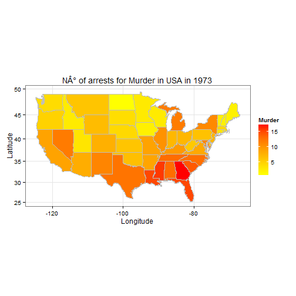

## What does the application do?

The application allows you to do an Exploratory Data Analysis to the "USArrests" dataset focused in:  

1. Maps: Graphic Map with the number of arrests in 1973 for Murder, Assault and Rape by State and the urban population in that year  
2. Compare: Barplots that compare differente zones of USA like North vs South or West vs Central, to check the states or zones with more arrests  
3. DataSet: You can check the complete dataset  

You can try the application [here](https://sfuenza.shinyapps.io/Developing-Data-Product---Project).

--- .class #id 

## The Data Set

The original USArrests dataset consists in 5 columns and 50 rows one for each state:

```
##            Murder Assault UrbanPop Rape
## Alabama      13.2     236       58 21.2
## Alaska       10.0     263       48 44.5
## Arizona       8.1     294       80 31.0
## Arkansas      8.8     190       50 19.5
## California    9.0     276       91 40.6
## Colorado      7.9     204       78 38.7
```
For the analysis a couple of changes were done:
* All the names of the states were change to lowercase to use a map of states data set that allows us to draw USA and Alaska was erase because it wasn't in the graphic map
* Two new columns were included:
      * North_South: Indicates if the State is in the North or South of USA
      * West_Central_East: Indicates if the State is in the West, Central or East of USA

--- .class #id

## How it works?

When you enter to the app you have 3 sections:

* Upper Navigation: Allows you to switch between the analyze section to the information to know a little bit more of the app
* Left Panel: Here you can select the States that are going to be included in the graphics and the dataset
* Main Panel: Here is where the graphics and the dataset are shown, you can switch between:
      * Maps: States Map comparison
      * Compare: Comparison between zones and states with barplots
      * Data Set: The complete data set as a table to check it


--- .class #id

## Example

Here you can see an example of the graphic map of USA:




